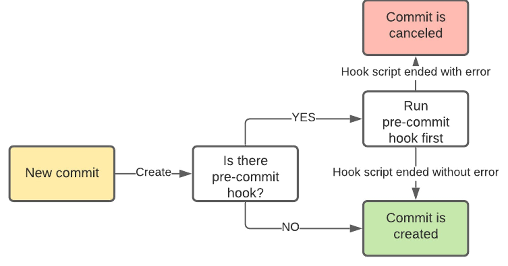

[[_TOC_]]

# Git Hooks

Git Hooks allows Git to run scripts as part of an action and have the outcome of the script defined if the action should occur or not. In this project we use both Client and Server side hooks. The Server side hooks protect the codebase from accidental pushes to the *main* branch making sure *main* is always in a working state. The Client side hooks, among other things, help prevent the developer from pushing incompliant / half-baked code.

Client side hooks are implemented on a per clone basis (you cannot clone client side hooks together with the repository). To ship Client side hooks with the repository, they are defined as code in the **hooks** directory. A script `Setup.ps1` in the root of the project will install the hooks. This script needs to be invoked once after the first clone (as described in the [Getting Started](getting-started.md) guide).

## pre-commit

The pre-commit hook protect the developer from committing to the local main branch. It also helps the developer to comply with the branch naming strategy (feature/name, e.g. network/proxy) by not allowing a commit to a faulty named branch.

## pre-push

The pre-push hook invokes the repo Quality tests which all should pass before code is allowed to be send into Azure DevOps. These same tests will be run as part of the Integration process into main (Pull Request). Since development is done in feature branches, a developer could decide it is fine to push upstream (e.g. end-of-day/week) even if there are errors in the Quality tests by appending `--no-verify` to the `git push` command. The server side Git hook will still enforce the QA tests to pass before merging to main is allowed.

To manually start the QA testing, simply run `Invoke-Pester` from within the repo root or when using vs-code, open the command palette and start the task `run test task`.